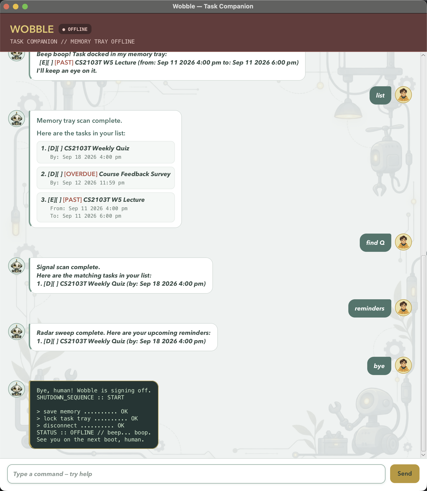

# Wobble User Guide

Wobble is a JavaFX task companion that stores tasks in its memory tray. It supports
ToDos, deadlines, and events, and can search, review, complete, and remove them.

## Contents

- [Quick start](#quick-start)
- [Command format](#command-format)
- [Command reference](#command-reference)
- [Date and time formats](#date-and-time-formats)
- [Reminders and status tags](#reminders-and-status-tags)
- [Saving and recovering data](#saving-and-recovering-data)
- [FAQ](#faq)
- [Troubleshooting](#troubleshooting)
- [Building the fat JAR](#building-the-fat-jar)
- [Verification and CI](#verification-and-ci)

## Quick start

Before starting Wobble, make sure JDK 25 is installed. Run commands from the
project root, which is the folder containing `build.gradle` and `gradlew`.

Start the JavaFX GUI with:

```bash
./gradlew run
```

Type a command in the input box and press `Enter` or click `Send`. Try these commands:

```text
todo read book
deadline submit report /by 2026-09-15 18:00
list
```



Enter `help` at any time to display the in-app command guide. Enter `bye` to run
Wobble's robot-themed shutdown sequence and exit. The GUI window is resizable, and the
conversation area can be scrolled.

You can also run `wobble.gui.Launcher` from IntelliJ IDEA. Set both the project SDK and
the Gradle JVM to JDK 25 first.

For a console-only session, run `wobble.Wobble.main()` from IntelliJ. Both interfaces
load and save tasks in `data/wobble.txt`, relative to the directory used to start Wobble.

## Command format

### Command notation

The angle brackets in a command describe a value that you replace; do not type the
angle brackets themselves. For example, `todo <description>` becomes `todo read book`.
The square brackets in `[days]` mean that the value is optional. The parameter markers
`/by`, `/from`, and `/to` are part of the command and must be typed exactly.

Descriptions may contain spaces. Do not surround descriptions, keywords, dates, or
times with quotation marks unless the quotation marks are intended to be part of the
text.

## Command reference

| Command format | Purpose | Example |
| --- | --- | --- |
| `todo <description>` | Add a task without a date | `todo read book` |
| `deadline <description> /by <date/time>` | Add a task with a due date or time | `deadline submit report /by 2026-09-15 1800` |
| `event <description> /from <start> /to <end>` | Add a task spanning a time range | `event meeting /from 2026-09-15 1400 /to 2026-09-15 1600` |
| `list` | Display every task | `list` |
| `find <keyword>` | Search descriptions, ignoring letter case | `find report` |
| `mark <number>` | Mark a task as done | `mark 2` |
| `unmark <number>` | Mark a task as not done | `unmark 2` |
| `delete <number>` | Remove a task | `delete 2` |
| `remove <number>` | Alias for `delete` | `remove 2` |
| `due on <date>` | Display deadlines and events occurring on a date | `due on 2026/09/15` |
| `reminders` | Show unfinished scheduled tasks in the next 7 days | `reminders` |
| `reminders <days>` | Choose a reminder window from 0 to 36,500 days | `reminders 14` |
| `help` | Display the command reference | `help` |
| `bye` | Shut down Wobble | `bye` |

> [!TIP]
> Wobble normalizes leading/trailing whitespace, repeated spaces, tabs, and command
> capitalization. Descriptions cannot be empty or contain control characters.
> Duplicate tasks and invalid commands are rejected without changing the task list.

Task numbers are one-based and come from the order shown by `list`. Use the current
number when marking, unmarking, deleting, or removing a task. The numbers can change
after a task is deleted. `remove` is an alias for `delete`; both commands behave the
same way.

<details>
<summary>Command details and examples</summary>

- `todo <description>` adds a task without a date or time.
- `deadline <description> /by <date/time>` adds a task due at a specified date or time.
  Example: `deadline submit report /by 2026-09-15 18:00`.
- `event <description> /from <start> /to <end>` adds a task spanning a time range.
  The end must be later than the start.
- `list` displays every task and its current number.
- `find <keyword>` searches descriptions for a case-insensitive substring and preserves
  the original task numbers. Example: `find report`.
- `mark <number>` completes a task; `unmark <number>` reopens it.
- `delete <number>` removes a task. `remove <number>` is an alias.
- `due on <date>` displays deadlines on that date and events that include it. Use a
  date-only value; if a time is supplied, Wobble uses only its date portion.
- `reminders` shows unfinished scheduled tasks in the default 7-day window.
  `reminders <days>` selects a window from 0 to 36,500 days.
- `help` displays the command guide; `bye` runs the shutdown sequence and exits.

</details>

## Date and time formats

Use a 24-hour clock. The recommended format is `yyyy-MM-dd HH:mm`, for example
`2026-09-15 18:00`.

| Input type | Format | Example |
| --- | --- | --- |
| Date only | `yyyy-MM-dd`, `yyyy.MM.dd`, or `yyyy/MM/dd` | `2026-09-15` |
| Date and time | `<date> HHmm` or `<date> HH:mm` | `2026/09/15 1800` |
| ISO date and time | `yyyy-MM-ddTHH:mm[:ss]` | `2026-09-15T18:00` |

The ISO form is useful for deadline and event commands. Use a date-only value with
`due on` because that command searches by calendar date. If a time is included with
`due on`, Wobble uses only its date portion.

> [!WARNING]
> Times use the 24-hour clock from `00:00` through `23:59`. Non-existent calendar
> dates such as `2027-02-30`, `24:00`, and AM/PM input such as `6:00 pm` are rejected.

Wobble displays a date-only value as `Sep 15 2026` and a value with a time as
`Sep 15 2026 6:00 pm`.

Past dates are allowed. An unfinished deadline or event with a past schedule is marked
in the task display instead of being rejected.

The format used for display is different from the format used for input. For example,
enter `deadline report /by 2026-09-15 1800`, not
`deadline report /by Sep 15 2026 6:00 pm`.

<details>
<summary>Common mistakes</summary>

- Use `/by`, `/from`, and `/to` exactly once where required.
- Put the description before the date marker, for example
  `deadline submit report /by 2026-09-15 18:00`.
- For an event, make the end later than the start:
  `event meeting /from 2026-09-15 14:00 /to 2026-09-15 16:00`.
- Use a real calendar date. Dates such as `2027-02-30` are invalid.
- Use a 24-hour time from `00:00` through `23:59`; `6:00 pm` and `24:00` are not
  accepted as command input.
- If a command is misspelled or its format is invalid, Wobble displays a diagnostic
  and may suggest a corrected command. The original command is not executed.

</details>

## Reminders and status tags

`reminders` shows unfinished deadlines and events whose scheduled date is within the
requested window. A deadline is scheduled at its due time; an event is scheduled at
its start time.

Past unfinished deadlines are shown with an `[OVERDUE]` tag. Past unfinished events
are shown with a `[PAST]` tag. These tags are displayed in red in the GUI. Marking a
task as done removes its past or overdue tag.

The reminder window does not include completed tasks. A past task from an earlier day is
not returned by `reminders`, but it remains visible in `list`, `find`, and applicable
`due on` results.

## Saving and recovering data

Tasks are written automatically whenever the list changes; there is no save command.
Wobble writes through a temporary file and replaces the save file so a failed write does
not partially replace the previous file.

The save file is relative to the directory from which Wobble is started. Starting
Wobble from a different directory can therefore use a different `data/wobble.txt`.
To reset Wobble for a fresh demonstration, close the application and remove or rename
`data/wobble.txt`; Wobble creates a new empty save file when the next task is saved.

If the save file contains malformed or duplicate records, Wobble skips those records,
shows a diagnostic, and loads the remaining valid tasks. Back up the file before
editing it manually; it uses an internal encoded format and is not intended as a normal
user-editing interface.

## FAQ

<details>
<summary>How do I move my tasks to another computer?</summary>

Install Wobble on the other computer and copy `data/wobble.txt` to the corresponding
`data/wobble.txt` path relative to the directory from which Wobble will be started.
Close Wobble before copying the file.

</details>

<details>
<summary>Why is my task list empty?</summary>

Check that Wobble was started from the directory containing the save file you intended
to use. Also check that `data/wobble.txt` exists and is readable.

</details>

<details>
<summary>Why did Wobble reject my command?</summary>

Check the command marker, required parameters, task number, date, and time. For a
misspelled or unrecognized command, Wobble may display a suggested command. Suggestions
are only prompts; Wobble never executes the suggested command automatically.

</details>

## Troubleshooting

<details>
<summary>Java and startup problems</summary>

If Gradle reports `invalid source release: 25`, or Java reports that a class was
compiled by a more recent version, the current terminal or IDE is using the wrong
Java version. Check it with:

```bash
java -version
```

It must report Java 25. In IntelliJ IDEA, set both the project SDK and the Gradle JVM
to JDK 25. On macOS with SDKMAN, switch Java in the same terminal session used to
run Wobble:

```bash
sdk use java 25.0.3.fx-zulu
java -version
```

If Wobble starts with an empty tray unexpectedly, check that you launched it from the
intended project directory and that `data/wobble.txt` is readable.

</details>

## Building the fat JAR

<details>
<summary>Build and run the executable JAR</summary>

From the project root, run:

```bash
./gradlew clean shadowJar
```

The executable JAR is created at `build/libs/wobble.jar`. Run it with Java 25:

```bash
java -jar build/libs/wobble.jar
```

JavaFX runtime dependencies for macOS, Windows, and Linux are included in the JAR.

</details>

## Verification and CI

<details>
<summary>Run local checks and view CI configuration</summary>

Run the local checks with:

```bash
./gradlew check
```

This runs JUnit tests and Checkstyle. GitHub Actions repeats the check on Ubuntu,
macOS, and Windows for every push and pull request using Java 25.

</details>
